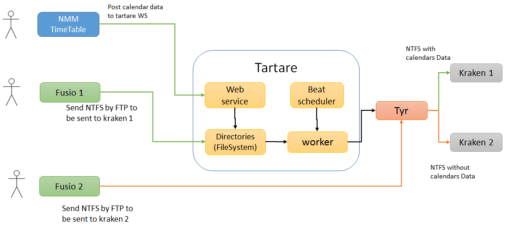
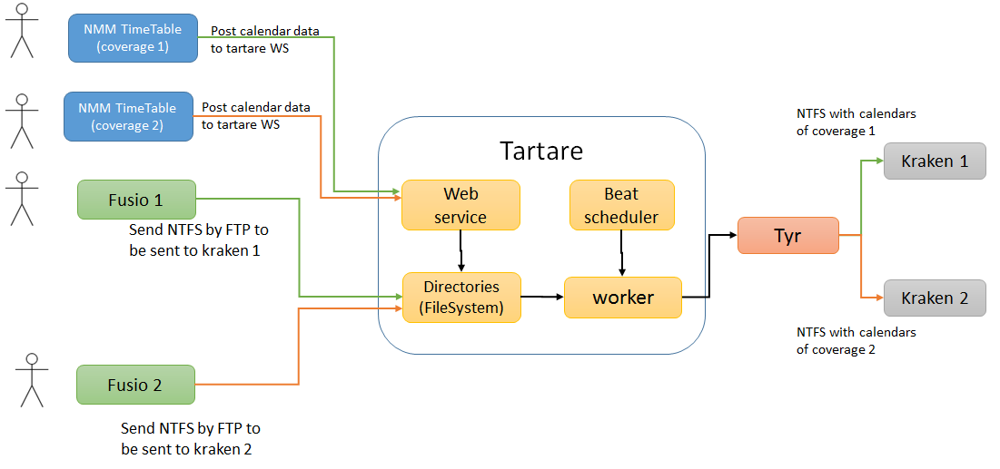

# tartare architecture

## Introduction
Tartare is a component designed for :
* collecting the grid calendar definitions created by the NMM TimeTable component,
* inserting them in a NTFS public transport database
* sending the resulting NTFS public transport database to the [Tyr](https://github.com/CanalTP/navitia/tree/dev/source/tyr) component

## Architecture
Tartare is composed of 3 distinct modules:
* a web service using [Flask](http://flask.pocoo.org/)
* a worker using [Celery](http://www.celeryproject.org/)
* a beat scheduler

### Actual architecture
Tartare is actualy beeing developped, and can only be used with on coverage (providing data to one Kraken).

### Final architecture (to be confirmed)

